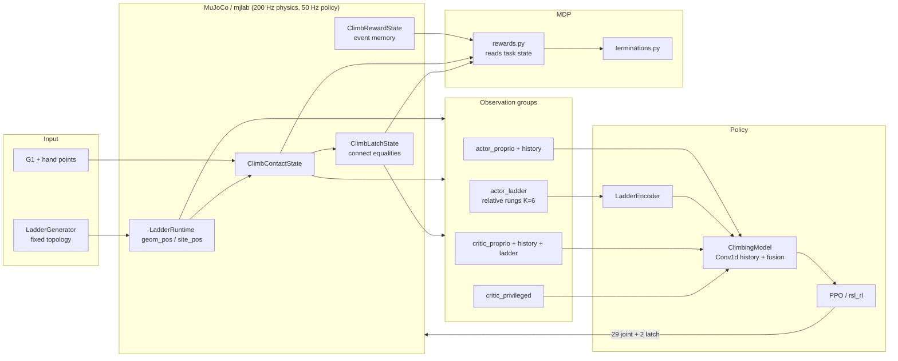

# Stage 10 — Documentation, regression suite, and handoff

## Scope

Final handoff for `General-Climbing-G1`. **Canonical user documentation** lives in the Docusaurus site:

- [Climbing Tutorial](../../../docs/docs/tutorials/climbing.md) — complete usage
- [Simulator Reference](../../../docs/docs/reference/climbing-simulator.md) — sim implementation
- [RL Reference](../../../docs/docs/reference/climbing-rl.md) — RL implementation

This file retains the validation matrix and quick commands. Stages 0–9 gate notes remain under `STAGE*.md`.

## Installation and assets

```bash
# Training stack (mjlab, rsl_rl, mujoco, mujoco-warp, torch)
pip install -e ".[train]"

# Canonical G1 robot model (required for climbing and tracking)
python scripts/setup/download_assets.py --only robots
```

| Asset | Path | Notes |
|-------|------|-------|
| G1 MJCF | `assets/robots/unitree_g1/g1_29dof.xml` | Shared with tracking; do not substitute |
| Hold-pose IK seed | `train_mimic/tasks/climbing/data/hold_pose_seed42.npz` | Debug/test only |

Pinned backend versions are recorded in [STAGE0_BASELINE.md](STAGE0_BASELINE.md).

## Task registration

| Constant | Value |
|----------|-------|
| Task ID | `General-Climbing-G1` |
| Experiment name | `g1_general_climbing` |
| Registry | `train_mimic/tasks/climbing/config/registry.py` |
| Env builder | `make_general_climbing_env_cfg()` in `config/env.py` |
| PPO runner | `ClimbingOnPolicyRunner` in `rl/runner.py` |
| Model | `ClimbingModel` in `rl/climbing_model.py` |

Registration is imported from `train_mimic/tasks/__init__.py` alongside tracking.
`General-Tracking-G1` remains the default task in `train_mimic.app.DEFAULT_TASK`.

```python
import train_mimic.tasks  # registers both tasks
from mjlab.tasks.registry import load_env_cfg

load_env_cfg("General-Climbing-G1")
load_env_cfg("General-Tracking-G1")  # unchanged
```

## Architecture



**Design constraints (fixed):**

1. Rungs use pure cylindrical collision geometry (high friction); no invisible
   flat support surfaces.
2. First policy uses **privileged relative rung geometry** in the torso frame.
3. Proprioception and ladder exteroception are separate groups/encoders before
   fusion; depth mode has an insertion point but no production provider.
4. Rewards read **simulator task state**, not actor observations.
5. Ladder topology is compiled once (`max_rungs`); poses and active masks vary
   at reset via batched `geom_pos` / `site_pos` on one mocap frame body.
6. Latch targets sit at external hand-sphere centres:
   `p_target = p_rung_axis − (r_rung + r_hand + δ) e_x_ladder`.

## Action space

| Index | Term | Dim | Description |
|------:|------|----:|-------------|
| 0 | `joint_pos` | 29 | Joint position offsets (same scale as tracking G1) |
| 1 | `latch` | 2 | Left/right attach-detach commands |

**Latch hysteresis** (`config/latch.py`):

| Command | Threshold | Effect |
|---------|-----------|--------|
| Attach | `g > 0.5` | Request attach (requires valid contact + capture radius) |
| Detach | `g < -0.5` | Request detach |
| Neutral | between | Preserve current latch state |

Direct rung-to-rung switching is disallowed; detach first.

## Observation definitions and frames

### Actor proprioception (101D flat + 10-frame history)

| Term | Dim | Frame / notes |
|------|----:|---------------|
| `robot_joint_pos_rel` | 29 | Relative to nominal |
| `robot_joint_vel` | 29 | |
| `robot_base_ang_vel_b` | 3 | IMU, body frame |
| `robot_projected_gravity_b` | 3 | Body frame |
| `prev_joint_action` | 29 | Previous joint command |
| `prev_latch_action` | 2 | Previous latch command |
| `hand_in_contact` | 2 | Boolean |
| `hand_attached` | 2 | Boolean |
| `attached_rung_rel_height` | 2 | Ladder-relative height; 0 when detached |

### Actor ladder (`actor_ladder`, K=6 rungs × 7 features = 42D)

Window: **2 rungs below + 4 above** pelvis ladder-relative height
(`h = u_L^T (p − p_L)`, not world Z).

Per rung: `endpoint_a_torso(3) + endpoint_b_torso(3) + valid(1)`

```text
p_endpoint_torso = R_world_torso^T (p_endpoint_world − p_torso_world)
```

Inactive rungs are masked; absolute rung IDs are not exposed to the actor.

### Critic-only (`critic_privileged`)

Base linear velocity, pelvis height, ladder frame pose in torso frame, active
rung heights with explicit validity mask.

### Ladder perception modes

| Mode | Status |
|------|--------|
| `relative_rungs` | **Production path** — privileged geometry |
| `depth` | **Not implemented** — fails at env construction until `DepthCameraProvider` exists; dummy depth encoder path exists for model tests only |

## Reward and termination configuration

All weights live in `ClimbingRewardConfig` (`config/rewards.py`); functions in
`mdp/rewards.py` return shape `[B]`.

| Term | Default weight | Semantics |
|------|---------------:|-----------|
| `upward_progress` | +10.0 | Pelvis ladder-relative height delta |
| `new_higher_attachment` | +2.0 | One-off event per new higher rung |
| `success` | +20.0 | Pelvis above top rung − clearance, min attached hands |
| `time_penalty` | −0.05 × dt | Physical-time cost while not successful |
| `action_rate` | −0.01 | L2 on action delta |
| `effort` | −1e-4 | Joint torque L2 |
| `invalid_latch` | −0.5 | Attach request without valid contact |

**Terminations:** success, fall (too low / too far from ladder), timeout, NaN;
optional latch overload (disabled by default).

**Event memory** prevents attachment-reward farming; resets with the env.

## Ladder configuration

Primary dataclass: `LadderConfig` in `config/ladder.py`.

| Parameter | Default | Notes |
|-----------|---------|-------|
| `max_rungs` | 12 | Compiled topology cap |
| Active rung count | 4–10 | Sampled at reset |
| `rung_radius` | 0.030 m | Factory supports `geometry_kind="cylinder"` only |
| `rung_length` | 0.45 m | |
| `rung_friction` | (1.2, 0.005, 0.0001) | Sliding, torsion, rolling |
| Spacing | 0.22–0.28 m | Strictly increasing active heights |
| `sites_per_rung` | 5 | Attachment sites along rung, offset toward robot |
| `inactive_rung_pose` | z = −50 | Parks unused rungs outside scene |

Easy/smoke presets pin subsets via `CurriculumConfig` → `curriculum_ladder_cfg()`.

## Curriculum controls

Dataclass: `CurriculumConfig` in `config/curriculum.py`. Each axis is a
`randomize_*` flag plus numeric ranges — no hard-coded stage switches.

**Easy preset** (`easy_curriculum_cfg()`): fixed 6-rung vertical ladder,
assisted hold IK reset, `initial_hand_attach_prob=1.0`, all randomization off.

**Expansion order (owner gate, one axis at a time):**

1. `initial_hand_attach_prob < 1.0`
2. `randomize_spacing=True`
3. `randomize_rung_count=True`
4. `randomize_ladder_pose=True`
5. `randomize_rung_physics=True`
6. `randomize_initial_pose=True`
7. `randomize_latch_capture=True`

## Debug modes

Entry point: `train_mimic/scripts/debug_climb.py`

| Mode | Purpose | Viewer |
|------|---------|--------|
| `scene` | Sampled ladder topology | Yes (`mjpython` on macOS) |
| `contacts` | Hand/rung contact identity | Yes |
| `latch` | Attach/detach scripted sequence | Yes |
| `observations` | Relative-rung values + debug lines | Yes |
| `rewards` | Per-term reward breakdown | Yes |
| `hold-pose` | Static four-contact gravity hold | Yes |
| `zero` | Zero-action MDP rollout | Headless |
| `random` | Random-action MDP rollout | Headless |
| `scripted-hold` | Stage 6 scripted hold agent | Optional |
| `scripted-mdp` | Full MDP scripted agent | Optional |
| `reset-stress` | Repeated randomized resets | Headless or viewer |
| `ppo-smoke` | Tiny PPO infrastructure run | Headless |
| `baseline-compare` | Zero vs random on easy env | Headless |
| `learnability` | Short train + baseline comparison | Headless |

### Fresh-run manual checklist

A new user should be able to run these in order (GPU optional for headless modes):

```bash
# 1. Ladder scene
mjpython train_mimic/scripts/debug_climb.py --mode scene --seed 42

# 2. Contacts
mjpython train_mimic/scripts/debug_climb.py --mode contacts --seed 42

# 3. Latch
mjpython train_mimic/scripts/debug_climb.py --mode latch --seed 42

# 4. Observations
mjpython train_mimic/scripts/debug_climb.py --mode observations --seed 42

# 5. Rewards
mjpython train_mimic/scripts/debug_climb.py --mode rewards --seed 42

# 6. Static hold
mjpython train_mimic/scripts/debug_climb.py --mode hold-pose --seed 42

# 7. Zero / random / scripted agents
python train_mimic/scripts/debug_climb.py --mode zero --seed 42
python train_mimic/scripts/debug_climb.py --mode random --seed 42 --num-envs 4
python train_mimic/scripts/debug_climb.py --mode scripted-hold --seed 42 --headless

# 8. PPO smoke
python train_mimic/scripts/debug_climb.py --mode ppo-smoke --seed 42
# or
python train_mimic/scripts/train_climb.py --smoke
```

Training and playback:

```bash
python train_mimic/scripts/train_climb.py --easy
python train_mimic/scripts/play_climb.py \
  --checkpoint logs/rsl_rl/g1_general_climbing/<run>/model_800.pt \
  --easy --seed 42
```

## Automated regression

**Full suite** (all stage tests + tracking guard):

```bash
python scripts/dev/run_climbing_regression.py
```

**CI-friendly** (skips long PPO/GPU tests):

```bash
python scripts/dev/run_climbing_regression.py --quick
```

**Direct pytest** (equivalent):

```bash
pytest tests/test_climbing_stage0.py tests/test_climbing_stage1.py \
  tests/test_climbing_stage2.py tests/test_climbing_stage3.py \
  tests/test_climbing_stage4.py tests/test_climbing_stage5.py \
  tests/test_climbing_stage6.py tests/test_climbing_stage7.py \
  tests/test_climbing_stage8.py tests/test_climbing_stage9.py \
  tests/test_climbing_regression.py \
  tests/test_task_registry.py -v
```

| Test file | Stage | Test count |
|-----------|------:|-----------:|
| `test_climbing_stage0.py` | 0 | 2 |
| `test_climbing_stage1.py` | 1 | 10 |
| `test_climbing_stage2.py` | 2 | 16 |
| `test_climbing_stage3.py` | 3 | 22 |
| `test_climbing_stage4.py` | 4 | 20 |
| `test_climbing_stage5.py` | 5 | 21 |
| `test_climbing_stage6.py` | 6 | 7 |
| `test_climbing_stage7.py` | 7 | 19 |
| `test_climbing_stage8.py` | 8 | 7 |
| `test_climbing_stage9.py` | 9 | 13 |
| `test_climbing_regression.py` | 10 | suite metadata |

## Final validation matrix

| Capability | Automated evidence | Manual evidence | Gate | Status |
|------------|-------------------|-----------------|------|--------|
| Existing TeleopIt baseline | `test_tracking_registry_unchanged`, `test_task_registry.py` | Tracking train/play unchanged | 0 | PASS |
| Pure-cylinder ladder | `test_climbing_stage1.py` | `--mode scene` | 1 | PASS |
| Hand contact identity | `test_climbing_stage2.py` | `--mode contacts` | 2 | PASS |
| Attach/detach latch | `test_climbing_stage3.py` | `--mode latch` | 3 | PASS |
| Relative rung observation | `test_climbing_stage4.py` | `--mode observations` | 4 | PASS |
| Reward correctness | `test_climbing_stage5.py` | `--mode rewards` | 5 | PASS |
| Brief static support | `test_climbing_stage6.py` | `--mode hold-pose` | 6 | PASS |
| Reset/batch robustness | `test_climbing_stage7.py` | zero/random/scripted play | 7 | PASS |
| PPO plumbing | `test_climbing_stage8.py` | `--mode ppo-smoke`, playback | 8 | PASS |
| Initial learnability | `test_climbing_stage9.py` | `--mode baseline-compare` | 9 | PASS |
| Reproducible handoff | `run_climbing_regression.py`, this doc | Fresh-run checklist above | 10 | PASS |

## Known backend limitations

1. **No production depth camera.** `ladder_observation.mode="depth"` fails at env
   build; only privileged relative rungs are wired for training.
2. **MuJoCo-Warp dynamic equality activation** is required for latches; verified
   on pinned GPU stack in Stage 3. CPU MuJoCo used for deterministic unit tests.
3. **Fixed compiled rung count.** Radius changes need recompile; runtime curriculum
   varies sliding friction and poses, not compiled radius (Stage 9 note).
4. **Single mocap ladder frame.** Per-rung mocap bodies were avoided due to Warp
   contact reliability issues.
5. **Latch break force** optional term exists but defaults off (constraint-force
   access limitations).
6. **`invalid_latch` penalty** can dominate early random policies; easy preset
   uses guaranteed initial attachment before weight tuning.

## Simulation vs real G1 capability

This task validates **MuJoCo ladder climbing mechanics and RL plumbing only**:

- Point-hand spheres and `connect` equalities are simulation abstractions.
- No sim-to-real deployment, ONNX export contract, or hardware latch mechanism.
- Static hold (Stage 6) is a sanity check, not a claim of physical G1 climbing.
- Do not infer real-world feasibility from simulated four-contact holds or
  privileged rung observations.

## Explicit non-goals

- Production RGB-D / depth perception
- Sim-to-real deployment for climbing
- Dexterous hands or foot attachment constraints
- Per-episode MJCF recompilation
- Broad domain randomization before fixed-task learning signal
- Preserving the 167D tracking ONNX observation contract

## Package layout

```text
train_mimic/tasks/climbing/
├── config/          # env, ladder, latch, rewards, curriculum, rl, registry
├── ladder/          # geometry, generator, state, contacts, latch, relative_rungs
├── mdp/             # actions, observations, rewards, terminations, events, metrics
├── rl/              # ClimbingModel, ladder encoders, runner
├── data/            # hold_pose_seed42.npz (debug)
├── debug_*.py       # mode-specific helpers
├── curriculum.py    # reset-time sampling
├── learnability.py  # baseline comparison harness
├── ppo_smoke.py     # Stage 8 smoke harness
└── STAGE*.md        # per-stage gate notes

train_mimic/scripts/
├── debug_climb.py   # unified debug entry
├── train_climb.py   # PPO training (--smoke, --easy)
└── play_climb.py    # checkpoint playback

scripts/dev/
└── run_climbing_regression.py

tests/test_climbing_stage*.py
tests/test_climbing_regression.py
```

## Exit criteria

| Criterion | Evidence |
|-----------|----------|
| Reproduction commands complete | This doc + README.md + debug_climb.py header |
| All design limitations explicit | Known limitations + non-goals sections |
| Regression command covers all stages | `run_climbing_regression.py` |
| Tracking task unchanged | Guard tests in regression suite |
| No knowledge only in agent history | STAGE0–10 docs + validation matrix |

## Next steps (post-handoff, owner-driven)

1. Run `--easy` training on GPU; compare multi-seed videos vs baselines.
2. Expand curriculum one axis at a time after learnability is confirmed.
3. Tune reward weights if `invalid_latch` remains dominant after contact learning.
4. Implement `DepthCameraProvider` when moving off privileged geometry.
5. Consider ONNX export with a new climbing observation contract (separate from tracking).
